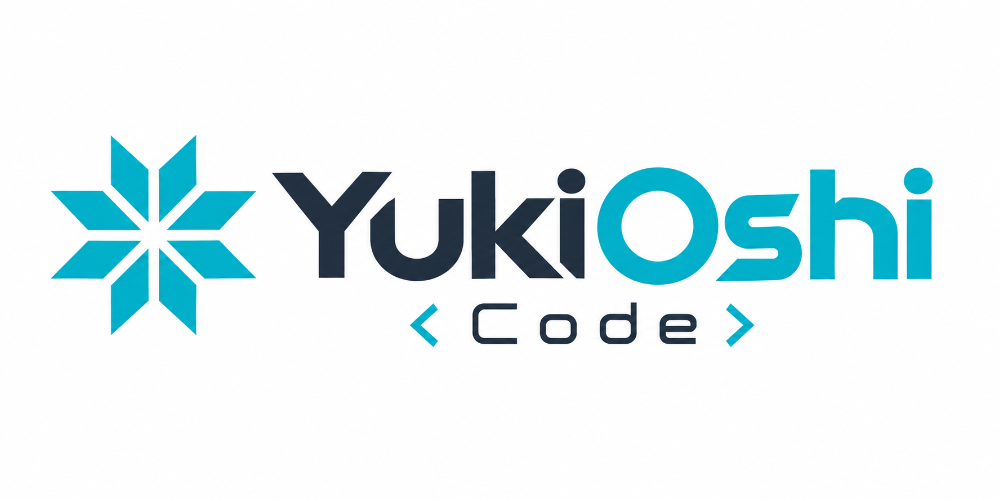

<p align="center">
  
</p>

<p align="center">
  <strong>An AI coding agent for the terminal, by <a href="https://yukioshi.com">YukiOshi</a>.</strong><br>
  Bring any model, keep control of what it can do, and check the evidence before you accept the work.
</p>

<p align="center">
  <a href="https://github.com/ahmed-alxawad/YukiOshiCode/releases/latest"></a>
  <a href="https://github.com/ahmed-alxawad/YukiOshiCode/actions/workflows/ci.yml"></a>
  <a href="LICENSE"></a>
</p>

---

YukiOshi Code (`yukioshi`) is a coding agent that runs in your terminal. It
reads and edits your code, runs commands, and works through multi-step tasks
with the model provider you choose. Permission modes, an optional OS sandbox,
repository trust, and hard safety blocks keep it inside the limits you set.

YukiOshi Code is proprietary, closed-source software. See
[License](#license).

## Install

**macOS and Linux**

```bash
curl -fsSL https://raw.githubusercontent.com/ahmed-alxawad/YukiOshiCode/main/install | bash
```

**Windows** (PowerShell)

```powershell
irm https://raw.githubusercontent.com/ahmed-alxawad/YukiOshiCode/main/install.ps1 | iex
```

The installers download the right binary for your system from the
[latest release](https://github.com/ahmed-alxawad/YukiOshiCode/releases/latest),
check it against the release's `SHA256SUMS`, and put it in `~/.yukioshi/bin`.
Each release is a single self-contained binary for Linux, macOS, and Windows on
x64 and arm64. See [docs/installation.md](docs/installation.md) for versions,
upgrades, and uninstalling.

## Quick start

```bash
cd your-project
yukioshi providers login   # pick a provider; sign in or paste an API key
yukioshi                   # open the terminal UI in this folder
```

Describe the task in plain language. In the terminal UI:

| Key             | Does                                               |
| --------------- | -------------------------------------------------- |
| `/`             | slash commands, including every skill              |
| `@`             | attach a file                                      |
| `tab`           | switch mode: Build, Plan, Goal, Reasoning, Research, Auto |
| `/usage`        | tokens and cost for this session and recent days   |
| `ctrl+p`        | command palette (permission mode, theme, and more) |
| `ctrl+x t`      | switch theme                                       |

For scripts and CI, `yukioshi run` sends one message and streams the result:

```bash
yukioshi run "explain what src/server does"
yukioshi run --mode auto "fix the failing test in test/api.test.ts"
yukioshi run --format json "list the TODO comments" > events.jsonl
yukioshi run -c "now add a test for it"   # continue the last session
```
`--mode` sets the permission mode; to let YukiOshi pick the working mode for each message, use `--agent auto`.

## What it does

- **Any model.** Claude, Codex (with ChatGPT sign-in), Grok (with SuperGrok
  sign-in), Gemini (with Google sign-in), OpenRouter, Kimi, Moonshot, Z.AI,
  NVIDIA NIM, and any OpenAI-compatible server. Several providers can be set up at once.
  [Providers](docs/providers.md)
- **A mode for each kind of work.** Build, Plan, Goal (work autonomously
  until done), Reasoning, and Research, or Auto, which picks one for each
  message. [Features](docs/features.md#modes)
- **You decide what it may do.** Four permission modes (`manual`, `auto`,
  `auto-all`, `plan`), per-tool rules, and hard blocks that refuse destructive
  commands and secret files in every mode.
  [Permissions and safety](docs/permissions-and-safety.md)
- **Safe in unfamiliar repositories.** A repository's hooks, plugins, local MCP
  servers, and custom LSP and formatter commands run only after you trust it,
  and trust lapses when that configuration changes. An optional OS sandbox
  confines shell commands and file edits to the project.
- **Credentials stay in your OS keychain**, not in plain files.
- **Evidence, not claims.** Optional post-turn verification runs your project's
  typecheck, lint, and test commands and reports what passed.
  [Features](docs/features.md)
- **Keeps going.** `/goal` works on an objective until a check says it is
  done, `/loop` runs a prompt again on an interval, and fallback models with
  API-key rotation carry a turn through rate limits and outages.
  [Features](docs/features.md#goals), [Providers](docs/providers.md#fallback-models-and-key-rotation)
- **Context that persists.** Search across past conversations, size-limited
  project memory, skills YukiOshi writes for itself (kept tidy by a curator),
  semantic code search, and a code-graph tool. Memory, self-written skills,
  code search, and the code graph are off until you enable them.
- **Works with your other tools.** MCP tool definitions load only when needed,
  tasks can be handed to Claude Code or Codex over ACP, and webhooks tell you
  when a turn finishes or needs you.
  [Configuration](docs/configuration.md)
- **Extensible.** Claude Code-compatible [hooks](docs/hooks.md),
  [skills](docs/skills.md), MCP servers, custom agents, and slash commands.
- **Looks like YukiOshi.** A light and dark theme built from the YukiOshi brand
  palette, with the official logo. [Appearance](docs/appearance.md)

## Documentation

| Guide                                                     | Covers                                                        |
| --------------------------------------------------------- | ------------------------------------------------------------- |
| [Installation](docs/installation.md)                      | Installers, versions, checksums, upgrades, auto-update, uninstall |
| [Providers](docs/providers.md)                            | Connecting models, credentials, OAuth, custom endpoints       |
| [Configuration](docs/configuration.md)                    | Config files and precedence, variables, common settings       |
| [Permissions and safety](docs/permissions-and-safety.md)  | Modes, rules, hard blocks, sandbox, trust, keychain           |
| [Features](docs/features.md)                              | Modes, goals, loops, usage, verification, memory, code search, subagents, delegation |
| [Hooks](docs/hooks.md)                                    | Running your own commands at points in the agent's work       |
| [Skills](docs/skills.md)                                  | Built-in skills and adding your own                           |
| [Appearance](docs/appearance.md)                          | Theme, light and dark mode, the logo                          |
| [Commands](docs/commands.md)                              | Every `yukioshi` command                                      |
| [Migrating from opencode](docs/migration-from-opencode.md) | Renamed names and what to change                             |
| [Development](docs/development.md)                        | Building from source, tests, releases                         |

## License

YukiOshi Code is proprietary, closed-source software developed by
[YukiOshi](https://yukioshi.com): © 2026 YukiOshi, all rights reserved. It is
not open source. The source code is public for a limited testing period only
and will not stay public, and it is not licensed for copying, modification, or
redistribution. You may install and use the official releases. See
[LICENSE](LICENSE).

YukiOshi Code is built on [opencode](https://github.com/anomalyco/opencode),
and its sandbox and code-indexing packages come from
[Kilo Code](https://github.com/Kilo-Org/kilocode). Those portions stay under
their own MIT license, and the bundled third-party skills under Apache-2.0. See
[NOTICE.md](NOTICE.md).

Found a security problem? Please report it privately; see
[SECURITY.md](SECURITY.md).
